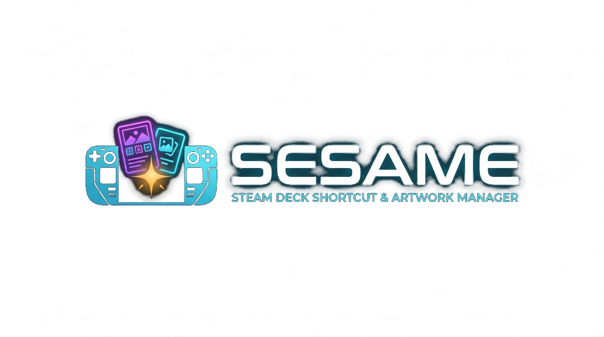

# SESAME

**Steam Easy Shortcut Artwork Manager Engine** — Steam Deck shortcut & artwork manager.



SESAME scans ROMs, Hydra games and apps on a Steam Deck, writes **its own** Steam shortcuts (Hydra and Steam ROM Manager entries stay untouched), and pulls artwork from SteamGridDB.

It runs in two ways:

1. **Native on the Steam Deck**
2. **From Windows over SSH**

SESAME is unofficial and is not affiliated with Valve, Nintendo, or any other game publisher. Use it at your own risk. The authors are not liable for any loss, damage, or other consequences, in any way, arising from use of this software.

## Steam Deck

Desktop Mode, no sudo. SESAME installs to `~/Applications/SESAME`. You do not need to delete that folder to update.

### First install

```bash
curl -fsSL https://raw.githubusercontent.com/ElectroBuilder/SESAME/main/install.sh | bash
```

Or from a git clone:

```bash
git clone https://github.com/ElectroBuilder/SESAME.git
cd SESAME
bash install.sh
```

### Update

Same as first install — the script overwrites `~/Applications/SESAME` in place:

```bash
curl -fsSL https://raw.githubusercontent.com/ElectroBuilder/SESAME/main/install.sh | bash
```

If you already cloned the repo:

```bash
git -C SESAME pull --ff-only && bash SESAME/install.sh
```

Or from inside the repo: `git pull --ff-only && bash install.sh` (same as `bash install.sh --update`).

The installer downloads the prebuilt Linux release (`sesame-linux-x64.tar.gz`), or builds from source if the download is unavailable.

Sessions, SSH keys and caches stay in `~/.local/share/sesame`. They are never copied into `~/Applications/SESAME`.

```
SESAME --desktop      # windowed desktop UI
SESAME --gamemode     # fullscreen controller UI
SESAME --local        # this machine
SESAME --remote       # SSH instead of local
```

## Windows (SSH)

```powershell
dotnet run --project src\Sesame.Windows\Sesame.Windows.csproj
```

Or open `SESAME.sln`.

1. **Sessions…** — Deck IP, import a private key
2. **Connect** — selected profile, then fallbacks, optional Wake-on-LAN
3. On a Steam Deck running SESAME itself, pick **This Steam Deck** (no SSH)

## Features

- File browser with ROM / mods / texture-pack drop targets
- Game Optimizer: shortcuts, SteamGridDB artwork, category masks, collections
- Store tab for mods / texture packs / ROM hacks (you supply your own dumps)
- Optional in-game text tools (experimental)

SESAME does not ship ROMs or copyrighted game assets.

## Build from source

.NET 8 SDK.

```powershell
dotnet build SESAME.sln -c Release
dotnet publish src\Sesame.Windows\Sesame.Windows.csproj -c Release
dotnet publish src\Sesame.Deck\Sesame.Deck.csproj -c Release -r linux-x64 --self-contained
```

## Layout

| Project | Role |
| --- | --- |
| `src/Sesame.Core` | Local + SSH host, optimizer, catalog |
| `src/Sesame.Windows` | Windows WPF app |
| `src/Sesame.Deck` | Avalonia app for SteamOS |
| `Assets/` | Brand pack (icons, Steam grids) |
| `install.sh` | Steam Deck / Linux installer |

## License

MIT — see [LICENSE](LICENSE). Provided “as is”, without warranty. Use at your own risk; the authors are not liable for anything that happens if you use SESAME.
